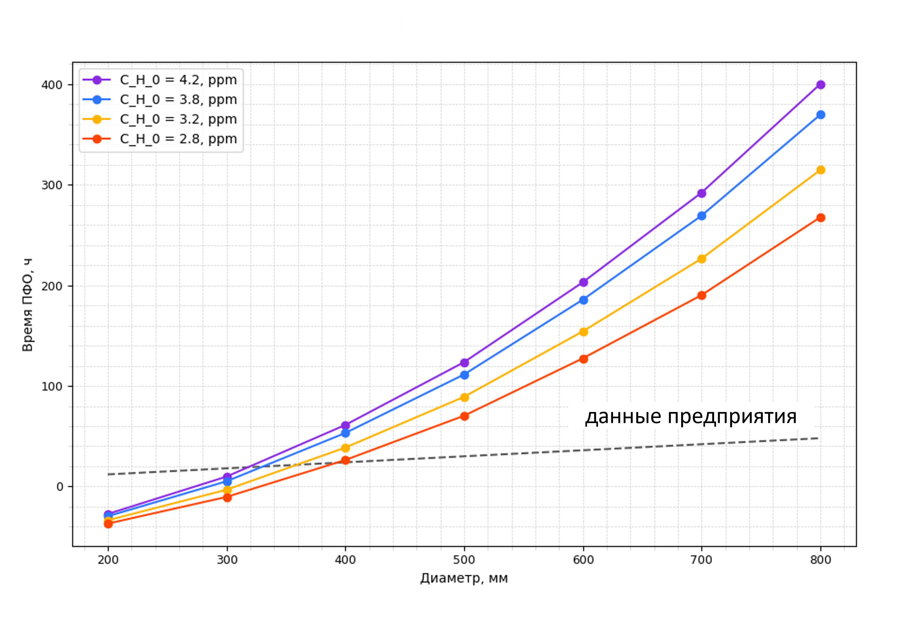
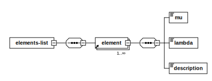
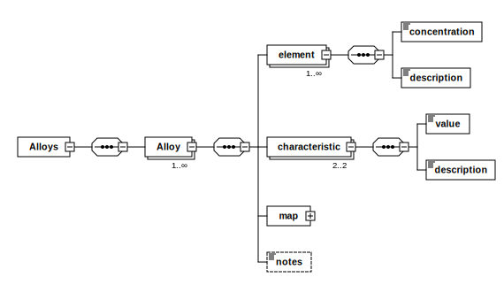
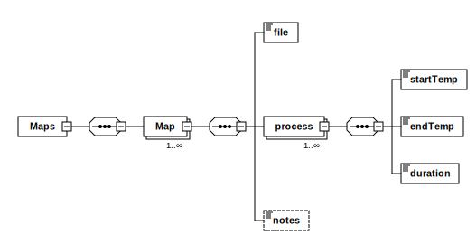

# Анализ и оптимизация издержек технологического процесса предприятия

## Короткое описание
&nbsp;&nbsp;&nbsp;&nbsp;Коммерческий проект по анализу потребления ресурсов металлургического предприятия и поиска путей оптимизации потребления ресурсов путём изменения этого технологического процесса.  
*Данные в этом документе изменены для сохранения конфиденциальности и являются примером.*

**Стек**: Python (`PyQt6` - графическая оболочка; `scipy`, `numpy`, `matplotlib` - математический анализ; `xml`, `reportlab` - работа с данными и выводом),  XML/XSD для автономного хранения данных, Data-Flow архитектура.

## Обзор результатов
**Внедрение**  
&nbsp;&nbsp;&nbsp;&nbsp;Проект в итоговой форме представляет собой графическую оболочку, в которой запрограммированна математическая модель расчета и анализа оптимальных режимов обработки металла на предприятии с учётом специфики предприятия. Выдаются рекомендации по подбору оптимальных режимов. Следование рекомендациям позволило **снизить энергетические затраты на ~10 млн рублей** в расчете на годовой объем выпуска, и **повысило объемы** выпуска продукции в среднем на **6%**.

**Экономия на ПО**  
&nbsp;&nbsp;&nbsp;&nbsp;Решение подобных задач в CAD/CFD системах потребует значительных вложений (**1-2 млн рублей**), так как необходимо покупать дорогостоящие пакеты моделирования и нанимать специалиста, который умеет в них работать. При этом большинство функционала таких пакетов будет оставаться неиспользованным, а масштабирование неудобно (так как такие пакеты заточены под моделирование процессов, а не конкретные технологические задачи). Предложенный способ позволяет значительно сократить затраты путём (в среднем **100 тыс рублей общих затрат**) точечного решения задачи на одном из узлов технического процесса и избавиться от необходимости нанимать дополнительный персонал.  
&nbsp;&nbsp;&nbsp;&nbsp;Проект легко можно подстроить под нужды предприятия, а сами расчёты занимают от **2 секунд до 5 минут**, в отличии от моделирования, например в COMSOL или ANSYS, где построение модели, моделирование процесса и адаптация под процесс занимает в среднем **1-2 часа**.


<div align="center">
    <a href="demo.gif">
        
    </a>
    <a href="comparsion.png">
        
    </a>
</div>

<div align="center">
    (а) &nbsp;&nbsp;&nbsp;&nbsp;&nbsp;&nbsp;&nbsp;&nbsp;&nbsp;&nbsp;&nbsp;&nbsp;&nbsp;&nbsp;&nbsp;&nbsp;&nbsp;&nbsp;&nbsp;&nbsp;&nbsp;&nbsp;&nbsp;&nbsp;&nbsp;&nbsp; (б)
</div>

<div align="center">
  <p style="font-size:90%; color:gray; margin-top:0px; text-align:left; max-width:900px;">
    <b>Обзор проекта:</b> (а) — построение тепловой карты оптимальных режимов; (б) — кривые технологических процессов обработки: смоделированные (цветные) и исходные (пунктирная) - в некоторых случаях предприятие тратило до 40 часов лишней работы установок, а в других случаях, напротив, недостаточно обрабатывало продукцию.
  </p>
</div>

## Содержание
- [Короткое описание](#короткое-описание)
- [Обзор результатов](#обзор-результатов)
- [Архитектура](#архитектура)

## Архитектура

### Схемы
Архитектура данных основана на самостоятельно разработанных XSD-схемах, обеспечивающих независимость и "решение в коробке". Схема архитектуры представлена ниже. После выбора нужной стали открывается дочернее окно взаимодействия с XML-библиотеками. Данные хранятся в XML, так как основное требование было обеспечить скорость разработки и максимальной независимости от сторонних пакетов. После выбора нужной стали вводятся оставшиеся переменные параметры и производится расчёт. Данные расчёта можно анализировать прямо в окне программы, либо сгенерировать отчёт в формате PDF или DOCX.


Необходимые для расчёта постоянные химических элементов находятся в elements_data.xml:


Данные о типе стали и содержащихся в них химических элементах, а также о процессе обработки для этой стали находятся в alloys_data.xml:


Данные процесса обработки (длительность, температуры), а также путь к файлу с графиком процесса находятся в process_map.xml:


### Описание сборки
Как сказано выше, требовалось "решение в коробке", поэтому сборка производилась в один исполняемый .EXE файл утилитой pyinstaller:
```bash
pyinstaller --paths=pipenviroment_/Lib/site-packages --add-data="pipenviroment_/Lib/site-packages/numpy;numpy" --onefile --noconsole main.py
```
>pyinstaller не увидел numpy при сборке, поэтому пришлось добавить его вручную.
